# AI & Data Engineer Technical Assessment: Production-Ready RAG System

This is a production-ready RAG application that demonstrates enterprise-grade engineering practices, advanced retrieval techniques, and scalable architecture design. This assessment evaluates my ability to build robust AI systems that can transition from prototype to production.

## RAG Architecture


## Document Processing Pipeline

```mermaid
graph LR
    A["Document(s)"] --> B["Parse<br/><br/>(OCR, Page<br/>images,<br/>Describe<br/>images)"]
    B -->|Text| C[Chunking]
    C -->|"Chunks +<br/>Document<br/>text"| D[Contextual<br/>Enrichment]
    D --> E[Contextual<br/>chunks]
    
    subgraph Pipeline["Document Processing Pipeline"]
        B
        C
        D
    end
    
    style A fill:#1a4d5c,stroke:#3b9dbf,stroke-width:2px
    style B fill:#0d3d2c,stroke:#2d9f5c,stroke-width:2px
    style C fill:#0d3d2c,stroke:#2d9f5c,stroke-width:2px
    style D fill:#0d3d2c,stroke:#2d9f5c,stroke-width:2px
    style E fill:#1a1a1a,stroke:#4d4d4d,stroke-width:2px
    style Pipeline fill:none,stroke:#666,stroke-width:2px,stroke-dasharray: 5 5
```



## Quick Start (Using Sample Documents)

For a quick start without generating the full dataset, you can use the pre-included sample documents:

```bash
python -m pipeline.process_sample
```

This will:
1. Process 2 sample documents from `data/sample/`
2. Create vector embeddings in ChromaDB
3. Build a BM25 index
4. Enable querying and API usage

## Full Setup (100 Documents)

This project includes the capability to generate 100 documents (50 PDFs from arXiv, 50 DOCXs generated using OpenAI).
To reproduce the full dataset:

```bash
# Generate documents (requires OpenAI API key)
python pipeline/generate_documents.py

# Process the generated documents
python pipeline/process_documents.py

# Create vector database and BM25 index
python pipeline/create_database.py
```

**Note:** Generating the full dataset requires:
- OpenAI API key for generating DOCX reports
- Internet connection for downloading PDFs from arXiv
- Significant processing time


## Database Justification
I selected ChromaDB as the vector database due to its ease of integration, zero setup cost, and native LangChain support. For this prototype (<1k documents), local persistence provides sufficient performance and storage. In a production-scale system, I would consider migrating to Qdrant or Pinecone for distributed storage, high availability, and enterprise features like horizontal scaling and metric-based search optimizations.
