```mermaid
graph LR
    A["Document(s)"] --> B["Parse<br/><br/>(OCR, Page<br/>images,<br/>Describe<br/>images)"]
    B -->|Text| C[Chunking]
    C -->|"Chunks +<br/>Document<br/>text"| D[Contextual<br/>Enrichment]
    D --> E[Contextual<br/>chunks]
    
    subgraph Pipeline["Document Processing Pipeline"]
        B
        C
        D
    end
    
    style A fill:#1a4d5c,stroke:#3b9dbf,stroke-width:2px
    style B fill:#0d3d2c,stroke:#2d9f5c,stroke-width:2px
    style C fill:#0d3d2c,stroke:#2d9f5c,stroke-width:2px
    style D fill:#0d3d2c,stroke:#2d9f5c,stroke-width:2px
    style E fill:#1a1a1a,stroke:#4d4d4d,stroke-width:2px
    style Pipeline fill:none,stroke:#666,stroke-width:2px,stroke-dasharray: 5 5
```

# AI & Data Engineer Technical Assessment: Production-Ready RAG System

This is a production-ready RAG application that demonstrates enterprise-grade engineering practices, advanced retrieval techniques, and scalable architecture design. This assessment evaluates my ability to build robust AI systems that can transition from prototype to production.


## Data Setup

This project uses 100 documents (50 PDFs from arXiv, 50 DOCXs generated using OpenAI).
To reproduce the dataset:

```bash
python src/ingestion/generate_documents.py
```


