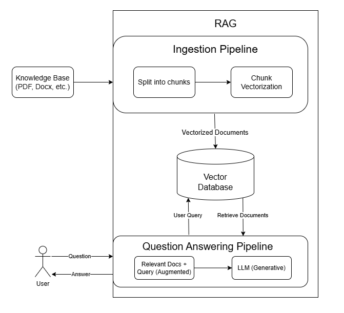

# AI & Data Engineer Technical Assessment: Production-Ready RAG Application

This is a production-ready RAG application that demonstrates enterprise-grade engineering practices, advanced retrieval techniques, and scalable architecture design. This assessment evaluates my ability to build robust AI systems that can transition from prototype to production.


## Live Demo

**Try it now:** [https://rag-system.takanov.com/](https://rag-system.takanov.com/)


## Project Structure

```
├── src/
│   ├── api/
│   │   └── api.py              # FastAPI endpoints
|   |
│   ├── pipeline/               # Document processing
│   │   ├── chunk.py            # Chunking strategies
│   │   ├── ingest.py           # Document loading
│   │   └── preprocess.py       # PDF/DOCX → Markdown
│   |
│   ├── retrieval/              # Search components
│   │   ├── vector_store.py
│   │   ├── bm25_store.py
│   │   ├── hybrid_ranker.py
│   │   └── query_expander.py
|   |
│   ├── ui/                     # UI components
│   │   └── app.py              # Streamlit app
│   │   └── config.py           # UI configuration
|   |
│   └── config.py               # Configuration
|   |
├── scripts/
│   ├── build.py                # Unified pipeline
│   ├── generate_data.py        # Dataset generation
|   |
├── data/
│   ├── processed/              # Markdown files
│   ├── raw/                    # Generated documents
│   └── samples/                # Sample documents
|   |
├── tests/
│   └── concurrent_requests.py  # Test concurrent requests
|   |
├── Dockerfile.api              # Docker configuration for API
├── Dockerfile.ui               # Docker configuration for UI
├── README.md                   # This file
├── requirements.txt            # Shared dependencies
├── requirements-ui.txt         # UI dependencies
└── requirements-api.txt        # API dependencies
```

## RAG Architecture



## Document Processing Pipeline

```mermaid
graph LR
    A["Document(s)"] --> B["Parse<br/><br/>(OCR, Page<br/>images,<br/>Describe<br/>images)"]
    B -->|Text| C[Chunking]
    C -->|"Chunks +<br/>Document<br/>text"| D[Contextual<br/>Enrichment]
    D --> E[Contextual<br/>chunks]
    
    subgraph Pipeline["Document Processing Pipeline"]
        B
        C
        D
    end
    
    style A fill:#1a4d5c,stroke:#3b9dbf,stroke-width:2px
    style B fill:#0d3d2c,stroke:#2d9f5c,stroke-width:2px
    style C fill:#0d3d2c,stroke:#2d9f5c,stroke-width:2px
    style D fill:#0d3d2c,stroke:#2d9f5c,stroke-width:2px
    style E fill:#1a1a1a,stroke:#4d4d4d,stroke-width:2px
    style Pipeline fill:none,stroke:#666,stroke-width:2px,stroke-dasharray: 5 5
```




### Setup

The full setup generate 100 documents - 50 PDFs from arXiv, 50 DOCXs generated using OpenAI. For a quick start without generating the full dataset, use the `--samples` flag.


```bash
pip install -r requirements-api.txt
pip install -r requirements-ui.txt

# Add your OpenAI API key
echo "OPENAI_API_KEY=your_api_key" > .env

# Generate dataset (Optional. For quick start, use the samples dataset instead.)
python -m scripts.generate_data

# Process sample docs (2 files, ~1min to run)
python -m scripts.build --samples

# Full setup
python -m scripts.build

# Start API server
python -m src.api.api
```

This process will:
1. Download PDFs from arXiv and generate DOCXs using OpenAI (if no flag is used)
2. Process documents from `data/raw/` or `data/sample/`
3. Create vector embeddings in ChromaDB
4. Build a BM25 index
5. Enable querying and API usage


**Note:** Generating the full dataset requires significant processing time and internet connection.

## Endpoint descriptions and example usage

Visit `http://localhost:8000/docs` or `http://localhost:8000/redoc` for the API documentation.

```bash
curl -X GET "http://localhost:8000/health"
curl -X GET "http://localhost:8000/ask?query=What%20is%20machine%20learning"
curl -X GET "http://localhost:8000/ask?query=ML&k=5&alpha=1&expand_query=true"
curl -X GET "http://localhost:8000/ask?query=ML&k=5&alpha=0&expand_query=true"
curl -X GET "http://localhost:8000/search?query=neural%20networks&file_type=md"
curl -X GET "http://localhost:8000/search?query=neural%20networks&k=3&alpha=0"
curl -X GET "http://localhost:8000/search?query=neural%20networks&k=3&alpha=1"
curl -X GET "http://localhost:8000/random-metadata"
```

Parameters:
- `query`: Your question (1-500 characters)
- `k`: Number of context chunks (1-20, default: 5)
- `alpha`: Vector search weight (0-1, default: 0.5)
  - 0 = Only BM25 (keyword search)
  - 1 = Only vector search (semantic)
  - 0.5 = Balanced hybrid
- `expand_query`: Enable query expansion (default: false)


## Features

### Core Capabilities
1. **Document Processing Pipeline**:
    - **Dataset**: Process 100 documents (50 PDFs from arXiv, 50 DOCXs generated using OpenAI)
    - **Format Support**: PDF and DOCX
    - **Smart Chunking**:
      - Semantic-based chunking for PDFs (embeddings-based)
      - Chunk overlap in markdown header-aware chunking
      - Document-type-specific strategies (semantic, markdown, recursive)
    - **Preprocessing**: OCR, table extraction, image description (Docling)
2. **Hybrid Search Implementation**
    - **Vector Search**:  Implement semantic search using ChromaDB vector store
    - **Keyword Search**: Implement keyword search using BM25 index
    - **Hybrid Ranking**: Implement hybrid ranking using BM25 and vector search
    - **Metadata filtering**: Filter results by file type
3. **Advanced RAG Features**
    - **Query expansion/rewriting**: Implement query expansion/rewriting using LLM
    - **Source attribution with confidence scores**: Track and score document contributions
4. **Production Engineering**
    - **RESTful API with proper error handling and validation**
    - **Handle at least 10 concurrent requests efficiently**: See `tests/concurrent_requests.py` for load testing
    - **Dockerize the application**

## Architecture Decisions

### Dataset Composition Justification
I selected a mixed dataset of **50 PDFs from arXiv and 50 synthetic documents generated using OpenAI** because:
- Provides real-world research papers with complex formatting, equations, and academic structure
- Complements them with synthetic reports for controlled topic diversity and balanced content length
- Ensures coverage of multiple writing styles and document complexities (formal academic vs. generated summaries)
- Facilitates robust testing of preprocessing, chunking, and retrieval across varied document structures

### Vector Database Justification

I selected **ChromaDB** for this implementation because:
- Zero setup cost and easy local development
- Native LangChain integration
- Sufficient performance for <1k documents
- Local persistence without external dependencies


I selected **BM25** for lexical search because:
- Incorporates term frequency saturation and length normalization for balanced scoring
- Delivers higher relevance than TF-IDF for real-world queries
- Integrates smoothly with vector search for hybrid retrieval setups


### Framework Justification

I selected LangChain as the orchestration framework because:
- Provides modular abstractions for document loading, chunking, embedding, and retrieval
- Offers native integration with `OpenAI` embeddings and `ChromaDB` vector store
- Simplifies hybrid search pipelines through standardized `Document` and `Retriever` interfaces
- Active ecosystem with community extensions (e.g., `text splitters`, `experimental chunkers`) that accelerate development

## Scaling Strategy

### Current Capacity
- Documents: <10k
- Queries: <100/sec
- Storage: Local disk

### 10x Growth (100k docs, 1k QPS)
1. **Caching**: Redis for embeddings + query results (60-80% hit rate)
2. **Read replicas**: 3x ChromaDB instances behind load balancer
3. **Async processing**: Celery for document ingestion (combined with a message broker)

### 100x Growth (1M docs, 10k QPS)
1. **Managed vector DB**: Migrate to Pinecone/Weaviate (multi-tenancy support)
2. **Distributed indexing**: Kafka + worker pool for parallel processing
3. **Sharding**: By document type or date range
4. **CDN**: Cache popular query results at edge


## Concurrent Request Handling

The API efficiently handles 10+ concurrent requests:
- **Test result:** 10 concurrent requests completed in ~5s
- Uses FastAPI's async architecture
- See `tests/concurrent_requests.py` for load testing

Run test:
```bash
python -m tests.concurrent_requests
```

## Dockerization

### API Dockerization

The `.env` file is excluded from the Docker image via `.dockerignore`. We are passing sensitive credentials at runtime using `--env-file` or `-e` flags.

Before running the Docker container ensure you have processed documents and created indexes (either full or sample dataset):

```bash
docker build -f Dockerfile.api -t rag-system-api .

# Option 1: Use your .env file
docker run -p 8000:8000 --env-file .env rag-system-api

# Option 2: Pass the key directly
docker run -p 8000:8000 -e OPENAI_API_KEY=your_key_here rag-system-api
```

### UI Dockerization

```bash
docker build -f Dockerfile.ui -t rag-system-ui .
docker run -p 8501:8501 rag-system-ui

docker run -p 8501:8501
```

**Note:** The UI reads `API_URL` from `src/ui/config.py`, which checks `ENVIRONMENT` variable.
